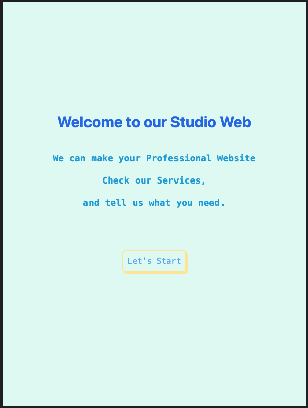
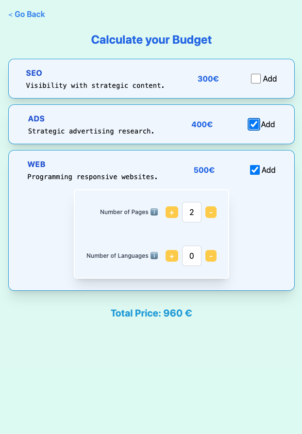

# Budget App

## 🌐 Live Demo
https://budget-app-react-omega.vercel.app/

## 👩‍🔧 Project Instructions - React mid-level. 
We will develop an application with the aim of streamlining calculations for the budget of a website, enhancing interaction with the user compared to the previous practice, through the use of checkboxes, input fields, and buttons.

Our website will have to respond and adjust the total price based on the options selected by the user.

## 📍 Exercise 1

Our application will start with three checkboxes. In this way, the user will have to decide which services they need to prepare the budget.

1. Conduct an SEO campaign (€300)

2. Conduct an advertising campaign (€400)

3. Create a website (€500)

Based on the options selected, the price will be modified.

We will develop a reactive form with the 3 products. Depending on the selected options, the price will change.

## 📍 Exercise 2

Once the checkboxes have been created to allow the user to select the type of service they need, we will provide them with the option to customize one of the services: creating a website, allowing them to choose the number of pages and languages.

For this purpose, it is necessary to define a component that will be visible when the user selects that they want to budget for a website. Within this component, the user can choose the number of pages and the number of languages for the website they wish to create.

Calculate the cost of the total budget and the total cost of the website using the following formula: (Number of pages * Number of languages) * €30.

## 📍 Exercise 3

Great! The user can now request 3 of our services and customize one of them.

To streamline the process for the user, we will create a series of buttons located next to the input field so that they can modify their selection in a more practical and innovative way. For example, they could type the desired quantity in a text box (this way, they can save on typing the required number of pages and languages).

## 📍 Exercise 4

To conclude this first phase of the project, it is necessary to implement a welcome screen for the user, explaining the purpose and functionality of the website.

By clicking a button, the Home component with the budget calculator will be displayed. There should also be a button that allows the user to go back.

## 📍 Exercise 5

To ensure that everyone understands the meaning of the input fields for the number of pages and languages, you will need to implement a button that opens a help popup.

Display the help message using Bootstrap modals, with the button featuring an information icon.

 

#  💾 React + Vite

The project has been developed with Vite due to its speed and efficiency for small projects. 

 

#  🎠 Style

The UI is design by me and I used Tailwind Css. 
The project is also fully responsive, for mobile, tablet and desktop.

  

